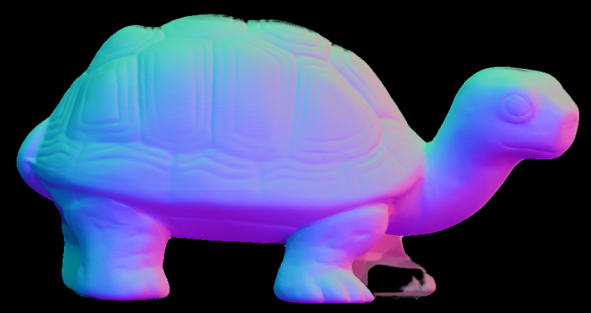

# Fully Connected Deep Photometric Stereo Network

This implementation is based on the paper "Deep Photometric Stereo Network" by Santo et al. (2017). \
Dataset used: https://vision.seas.harvard.edu/qsfs/Data.html
## Brief idea

The main idea of this method is to learn the mapping from input images to a normal map in a per-pixel manner using a fully connected neural network.

## Result
| DPSN Method | Matrix Multiplication Method |
|------------|----------------------------|
|  |  |
|  |  |
|  |  |